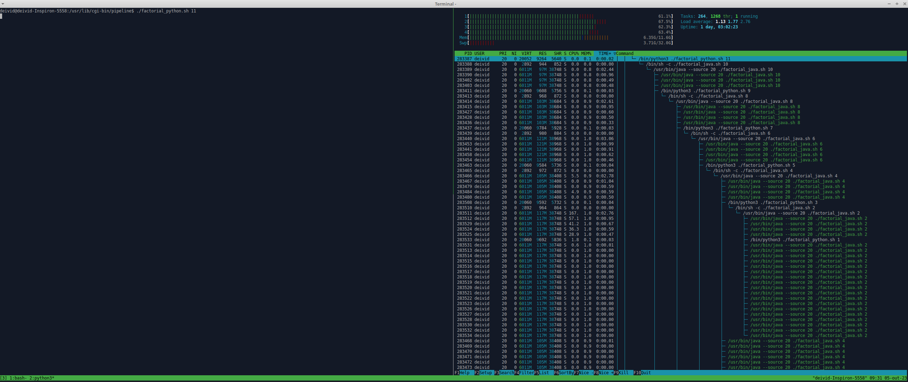
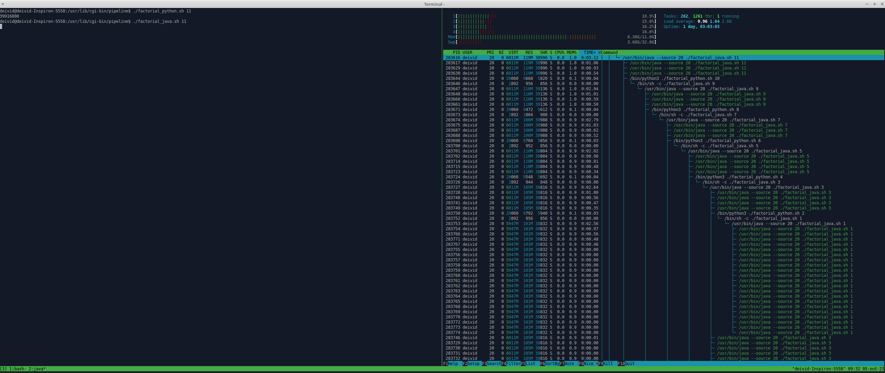

# Python and Java Bridge for Factorial Calculation

This script demonstrates a simple bridge between Python and Java, allowing you to calculate the factorial of a number. The Python script calls a Java program as a subprocess to perform the computation or inverse.

## Prerequisites

Before using this script, ensure you have the following prerequisites installed on your system:

- Python 3
- Java (JRE or JDK)
- `factorial_java.sh` (a Java program for factorial calculation)
- `factorial_python.sh` (a Python program for factorial calculation)


## Usage

1. Ensure that `factorial_java.sh` and `factorial_java.sh` is available in the same directory, and it correctly calculates the factorial.

2. Run the Python script with a numeric argument to calculate the factorial. For example:

```
./factorial_python.sh 5
```

This will calculate the factorial of 5.

3. The script will display the result once the computation is complete.

4. You can also run `factorial_java.sh` directly from the command line and pass the number as an argument. For example:

```
./factorial_java.sh 5
```

This will calculate the factorial of 5 using the Java program.

## Images



## Credits

This script was created as a demonstration of interprocess communication between Python and Java.
